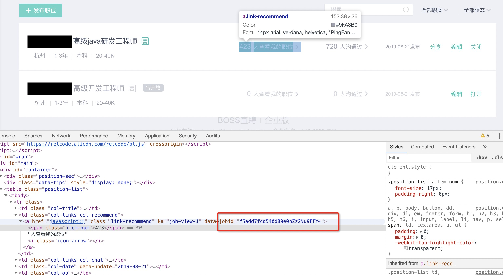

# boss-spider

## 脚本使用步骤(mac)
**建议使用v1版本，v2版本的接口容易被反爬虫限制访问**

### 1. 安装python3 

```
brew install python3
```

### 2. 安装依赖的python库bs4

```
pip3 install bs4
```

### 3. 获取cookie

- chrome登陆[boss直聘](https://www.zhipin.com) 
- 右键”检查“->Network->选中某个有效请求(请求域名为zhipin.com)->Headers->复制"cookie:"后面的字符串
- 将复制的cookie信息拷贝到```cookie.txt```中

### 4. 获取jobId【一个jobId对应你发布的一个职位，脚本是通过这个职位来获取对应推荐的候选人】

- 登陆进去后，点击左侧导航栏上的“职位管理”，或者直接进入[链接](https://www.zhipin.com/chat/im?mu=%2Fbossweb%2Fjoblist.html)
- 如图获取对应职位的jobId，替换代码中的jobId（boss.py中的第13行或者bossV2.py的第12行）

 

### 5. 自定义：脚本里面定义了些过滤规则，没有特殊要求的请忽略

- 学历过滤：本科生三年及以上、研究生两年及以上。
- 学校过滤：```985.txt 211.txt```中包含了985以及211工程大学。

### 6. 运行

```
python3 boss.py
```
或者
```
python3 bossV2.py
```
在步骤5中替换的jobId为默认为你推荐牛人的职位id，当你想同时使用多个jobId来运行脚本，可采用指定jobId的方式运行脚本，如下例：
```
python3 boss.py 952a3e6bdb3a318e03xy2tq7E1U~
python3 boss.py 9488aeda0e36a75203Ry39-9F1c~
```

### 7. 人工参与

因为当牛人回复的时候，脚本还暂不支持实时响应，需要抽出时间回复下牛人，简单进行```接受简历```以及```发起简历请求```的操作

### 8. 迭代

当你不断通过某一个职位获取简历，随着获取的简历越来越多，boss直聘推荐的人选会越来越少，且质量越来越差，这个时候，需要关闭之前的职位，重新申请一个一模一样的职位，并重复步骤5
